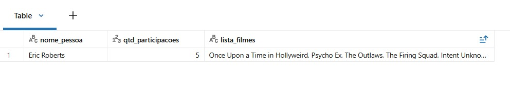
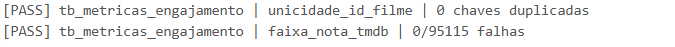

Este projeto apresenta um pipeline ETL desenvolvido em Databricks com PySpark, Spark SQL e Delta Lake, seguindo a Arquitetura Medallion e organizando os dados nas camadas Bronze, Silver e Gold.

Durante o desenvolvimento, meu foco foi construir um pipeline capaz de lidar com problemas reais de qualidade dos dados, mantendo a rastreabilidade e o desempenho necessários para aplicações de Business Intelligence e Inteligência Artificial.

# Resolução de casos de borda e anomalias

Durante o desenvolvimento, encontrei algumas inconsistências na base de origem do TMDB que poderiam gerar resultados analíticos incorretos. Para cada caso, precisei investigar a origem do problema e criar tratamentos específicos sem comprometer a informação original.

## As improváveis 66 participações de Kevin Hart em 2 anos

Durante a análise de engajamento, Kevin Hart aparecia com cerca de 66 filmes em apenas dois anos. A investigação mostrou que o mesmo filme existia na origem com IDs diferentes. Para resolver, apliquei uma deduplicação baseada em match_key e ano_lancamento utilizando uma Window Function ordenada por ingestion_datetime. Isso eliminou os clones de IDs múltiplos e preservou as continuações sem destruir as franquias.

Mesmo assim a contagem continuava inflacionada. Descobri que o TMDB possuía inconsistências de tradução e formatação para o mesmo filme, com variações como Die Hart 2 e Duro de Atuar 2. Apliquei um tratamento de exceções na camada Silver com Expressões Regulares para unificar essas variações num título padrão antes da geração da chave, reduzindo as participações de Kevin Hart para os seus 4 lançamentos reais.

Com a base finalmente limpa, enfrentei a armadilha de filmes do futuro registrados na origem com anos irreais de lançamento. Ajustei a consulta na Gold para ancorar o tempo apenas ao ano máximo de obras já lançadas. Com os dados estabilizados, Eric Roberts emergiu legitimamente como o ator mais prolífico dos últimos dois anos. Ele garantiu o topo do ranking com 5 participações validadas em Once Upon a Time in Hollyweird, Psycho Ex, The Outlaws, The Firing Squad e Intent Unknown.

## Problema de ano de lançamento em popularidade

Durante a criação do ranking de popularidade, alguns filmes apareciam com valores como `2020`, `2019` e `2018`. A investigação mostrou que esses valores eram anos de lançamento que haviam sido deslocados para a coluna `popularity` devido a um problema de Column Shift na origem.

O problema é que esses valores continuavam sendo números válidos. Um simples `.cast("DOUBLE")` não identificaria o erro. Para tratar isso, utilizei `try_cast` junto com uma validação por expressão regular que identifica valores no formato de anos.

Dessa forma, consigo diferenciar valores realmente inválidos de valores que são válidos numericamente, mas estão incorretos no contexto da coluna.

## Gêneros concatenados e valores fora do padrão

Durante a análise dos gêneros, percebi que alguns filmes apareciam com apenas um gênero, mas o valor armazenado revelava que havia mais informações escondidas na mesma string. Um exemplo era algo como `Western | Drama | Action`, que estava sendo tratado como um único gênero.

Também encontrei registros com caracteres estranhos, valores numéricos e outros conteúdos que não correspondiam a gêneros válidos. Isso fazia com que a contagem por gênero ficasse distorcida.

Na Silver, resolvi isso separando as strings com `split` e `explode`, normalizando os valores com `trim` e `initcap` e, principalmente, validando cada resultado contra uma lista oficial de gêneros válidos do TMDB, definida em `GENEROS_VALIDOS`.

Assim, em vez de contabilizar `Western | Drama | Action` como um único gênero, o pipeline consegue transformar o registro em três relacionamentos distintos. Também elimino valores que não representam gêneros válidos antes que eles cheguem à Gold e às análises finais.

# Resumo dos diferenciais arquiteturais

## Governança e rastreabilidade

Preservei o `ingestion_datetime` criado na Bronze como um registro histórico da chegada dos dados ao Data Lake. Esse valor não é sobrescrito nas camadas seguintes e é utilizado principalmente durante a deduplicação.

Isso permite identificar qual versão de um registro chegou mais recentemente sem perder a informação original de ingestão.

## Tratamento defensivo contra Column Shift

Para lidar com os problemas de deslocamento encontrados na origem, utilizei `try_cast` para valores que não podem ser convertidos e expressões regulares para identificar valores que são numericamente válidos, mas contextualmente incorretos.

Um exemplo é um ano como `1969` aparecendo na coluna `popularity`. Embora possa ser convertido normalmente para número, esse valor não representa uma métrica válida de popularidade.

## Framework de Data Quality

Criei funções como `dq_check_unique` e `dq_check_condition` para acompanhar a qualidade dos dados durante o processamento.

Os resultados são registrados como `PASS` ou `FAIL` e podem ser persistidos, permitindo acompanhar as condições de qualidade do pipeline e criar uma camada de observabilidade.

## Otimização física Delta

Ao final da Silver, utilizo `OPTIMIZE` e `ZORDER BY` para melhorar a organização física das tabelas Delta.

O `OPTIMIZE` reduz a fragmentação causada por arquivos pequenos, enquanto o `ZORDER` melhora o Data Skipping em consultas que utilizam `id_filme`, reduzindo a quantidade de dados lidos nos joins posteriores.

## Surrogate Keys com SHA-256

Na modelagem Star Schema, optei por gerar as Surrogate Keys utilizando SHA-256 em vez de funções como `monotonically_increasing_id`.

Com `hex(sha2(id, 256))`, a mesma chave de origem sempre produz o mesmo identificador. Isso garante estabilidade durante reprocessamentos e atualizações incrementais.

## Tratamento de nulos para GenAI

Na preparação dos dados para RAG, utilizei `coalesce`, `concat_ws` e `collect_list` para evitar que valores nulos comprometam o contexto enviado ao modelo.

Quando uma informação não está disponível, utilizo fallbacks como “diretor não especificado”, mantendo o restante das informações do filme disponível para o LLM.

# 01. Camada Bronze

Na Bronze, mantenho os dados o mais próximo possível da origem e realizo a ingestão inicial no Unity Catalog.

A leitura utiliza configurações como `escape='"'` e `multiLine=True`, necessárias para arquivos que possuem sinopses e avaliações com quebras de linha internas.

Também adiciono o `ingestion_datetime`, preservando o momento da chegada dos dados ao Data Lake. Esse valor permanece imutável nas etapas seguintes.

Para a API do BACEN, utilizo `dbutils.widgets` para parametrizar as datas. Caso nenhuma data seja informada, o pipeline utiliza automaticamente um período de sete dias, evitando falhas durante execuções automatizadas.

# 02. Camada Silver

Na Silver, concentro as principais etapas de limpeza, padronização, validação e deduplicação dos dados.

## `tb_info_filmes`

Utilizo `try_to_date` em conjunto com `coalesce` para testar diferentes formatos de data. Valores que não podem ser interpretados são transformados em `NULL` sem interromper o processamento.

## Deduplicação

Utilizo Window Functions ordenadas por `ingestion_datetime` para identificar diferentes versões do mesmo registro e manter a versão mais recente.

## `tb_cotacao_dolar`

Como a API do BACEN não fornece cotações em fins de semana e outros dias sem funcionamento, criei um calendário contínuo para evitar buracos na série.

Depois, utilizo `F.last(ignorenulls=True)` para realizar o Forward Fill e carregar a última cotação disponível para os dias sem novos registros.

## `tb_metricas_engajamento`

Para lidar com valores incompatíveis com os tipos esperados, utilizo `try_cast`, transformando entradas inválidas em `NULL`.

Além disso, aplico a validação por expressão regular na coluna `popularity` para identificar anos que foram deslocados para essa coluna. Assim, trato tanto erros de formato quanto erros de contexto.

## Normalização e Validação de Gêneros
Nas tabelas tb_generos e tb_pessoas_empresas, o processo envolve a padronização e divisão de strings utilizando split e explode.

Para garantir a confiabilidade analítica e blindar a tabela de géneros contra lixo textual, numérico ou colunas deslocadas que vinham da origem, implementámos uma validação rigorosa comparando os valores contra uma lista oficial de géneros válidos do TMDB (GENEROS_VALIDOS), complementada com F.initcap() e F.trim().

Além disso, preservamos caracteres essenciais que fazem parte dos nomes de pessoas e empresas, como apóstrofos e hífens, evitando corromper identidades reais (ex.: O'Connor).
Tratamento de Limites e Valores Fora do Escopo (Range Validation)
Para garantir que nenhuma métrica ou indicador de engajamento violasse as regras físicas e de negócio, implementámos validações estritas de intervalo (range checks) em conjunto com a limpeza de caracteres inesperados:

Validação de Notas (TMDB e IMDb): Assegurámos que todas as notas médias de avaliação estivessem estritamente limitadas entre 0 e 10 (rating BETWEEN 0 AND 10). Quaisquer valores fora deste intervalo lógico (ou corrompidos por falhas de extração) foram mapeados defensivamente para NULL.

Consistência de Contagens e Durações: Campos de contagem de votos e duração de filmes (runtime, vote_count, num_votes) foram filtrados para aceitar apenas valores inteiros maiores ou iguais a zero, eliminando registos negativos ou lixos alfanuméricos indesejados.

Resiliência a Caracteres Inesperados: Em campos textuais e numéricos mistos, combinámos o uso de try_cast e limpeza de strings para que pontuações isoladas ou caracteres especiais espúrios não causassem falhas fatais de type mismatch durante o processamento distribuído.

## Manutenção e otimização

Ao final da Silver, aplico `OPTIMIZE` e `ZORDER` para melhorar a organização física das tabelas e reduzir o volume de dados lido nas consultas posteriores.

# 03. Camada Gold

Na Gold, organizo os dados tratados em um Star Schema preparado para consumo analítico e ferramentas de BI.

## Surrogate Keys

As dimensões `dim_movies`, `dim_genres`, `dim_people` e `dim_companies` utilizam SHA-256 para gerar suas Surrogate Keys.

A mesma chave de origem sempre produz o mesmo identificador, garantindo estabilidade durante reprocessamentos.

## `dim_reviews`

As principais métricas das avaliações são pré-agregadas nessa dimensão, como quantidade de reviews e média das notas.

Assim, o BI não precisa processar milhões de registros de avaliações sempre que essas informações forem consultadas.

## Tabelas Bridge

Para evitar a multiplicação de registros da Fato, isolei os relacionamentos entre filmes, pessoas, gêneros e empresas nas tabelas `bridge_movie_person`, `bridge_movie_genre` e `bridge_movie_company`.

A `fact_movies_performance` mantém o grão de uma linha por filme. Dessa forma, a bilheteira de um filme com 50 atores continua sendo contabilizada apenas uma vez.

## Tipagem financeira

As métricas financeiras da Fato recebem `decimal(18,2)` para os valores em BRL e USD.

Isso evita problemas de precisão relacionados ao uso de ponto flutuante e torna os cálculos financeiros mais seguros no BI.

# Entrega para Inteligência Artificial

Uma das entregas finais é a tabela `gold_genai_movies_context`, criada para aplicações de GenAI e RAG.

Nessa etapa, transformo os dados estruturados dos filmes em um contexto textual utilizando `concat_ws`, `collect_list` e `coalesce`.

Os atores podem ser agrupados em uma única informação e os campos ausentes recebem fallbacks adequados. Assim, um filme sem diretor registrado pode receber “diretor não especificado” sem comprometer o restante do contexto.

## Desafio de Analytics

Respostas às 6 perguntas de negócio, geradas pelo `Silver_to_Gold`. As consultas em si estão no notebook; aqui é um **snapshot de uma execução**. Os valores em R$ podem variar conforme a cotação utilizada na execução.

**1. Receita total (R$) de todos os filmes:** R$ 864.695.614.124,59

**2. Top 5 filmes por popularidade:**

| # | Título            | Popularidade |
| - | ----------------- | -----------: |
| 1 | blue beetle       |     2994.357 |
| 2 | Gran Turismo      |     2680.593 |
| 3 | The Nun II        |     1692.778 |
| 4 | Meg 2: The Trench |     1567.273 |
| 5 | retribution       |     1547.220 |

**3. Filmes por gênero:** 19 gêneros encontrados

| Gênero          | Quantidade de filmes |
| --------------- | -------------------: |
| Drama           |               29.554 |
| Documentary     |               18.324 |
| Comedy          |               16.947 |
| Thriller        |                9.165 |
| Horror          |                8.848 |
| Romance         |                6.893 |
| Action          |                5.398 |
| Crime           |                4.221 |
| Animation       |                4.001 |
| Science Fiction |                3.364 |
| Family          |                3.319 |
| Mystery         |                2.922 |
| Fantasy         |                2.885 |
| Music           |                2.531 |
| Adventure       |                2.530 |
| History         |                2.139 |
| War             |                  846 |
| Western         |                  373 |

**4. Top 10 filmes por receita**

| #  | Título                      |    Receita (US$) |      Receita (R$) |
| -- | --------------------------- | ---------------: | ----------------: |
| 1  | Avengers: Endgame           | 2.800.000.000,00 | 14.439.320.000,00 |
| 2  | Avatar: The Way of Water    | 2.320.250.281,00 | 11.965.298.674,09 |
| 3  | AVENGERS: INFINITY WAR      | 2.052.415.039,00 | 10.584.099.114,62 |
| 4  | spider-man: no way home     | 1.921.847.111,00 |  9.910.773.366,72 |
| 5  | The Lion King               | 1.663.075.401,00 |  8.576.313.535,42 |
| 6  | Top Gun: Maverick           | 1.488.732.821,00 |  7.677.246.284,61 |
| 7  | Barbie                      | 1.428.545.028,00 |  7.366.863.854,89 |
| 8  | The Super Mario Bros. Movie | 1.355.725.263,00 |  6.991.339.608,76 |
| 9  | Black Panther               | 1.349.926.083,00 |  6.961.433.817,42 |
| 10 | Star Wars: The Last Jedi    | 1.332.698.830,00 |  6.872.594.596,43 |

**5. Ator com mais participações nos filmes lançados nos últimos 2 anos:** Eric Roberts, com **5** participações.

**6. Produtora com maior lucro nos últimos 5 anos:** Universal Pictures, com **US$ 6.181.119.834,00** de lucro.

# Orquestração e Otimização (Databricks Workflow)
Para automatizar a rotina de dados em produção, implementámos um Databricks Workflow chamado CineData_Pipeline_Producao, estruturado em três tarefas sequenciais com dependências. A Task_Bronze executa a ingestão inicial, a Task_Silver depende da conclusão bem-sucedida da anterior para aplicar a limpeza, validações de Data Quality, tratamento de anomalias e deduplicação, e por fim a Task_Gold consome a camada intermédia para consolidar a modelagem dimensional em Star Schema. Para simular uma rotina real de produção, o job foi configurado com um agendamento automático diário via expressão Quartz Cron (0 0 6 * * ?) no fuso horário de Brasília, garantindo atualizações consistentes às 06:00 da manhã, com toda a orquestração versionada de forma reproduzível através de Infraestrutura como Código.

# Resultado final

O CineData Analytics foi desenvolvido para ser mais do que um pipeline de transformação de dados. A estrutura foi pensada para lidar com problemas reais da origem, como duplicidades, Column Shift, valores inconsistentes e campos ausentes.

Com a Arquitetura Medallion, as regras de Data Quality, a preservação da linhagem e as otimizações do Delta Lake, consegui estruturar uma base preparada tanto para análises de BI quanto para aplicações de Inteligência Artificial e RAG.

